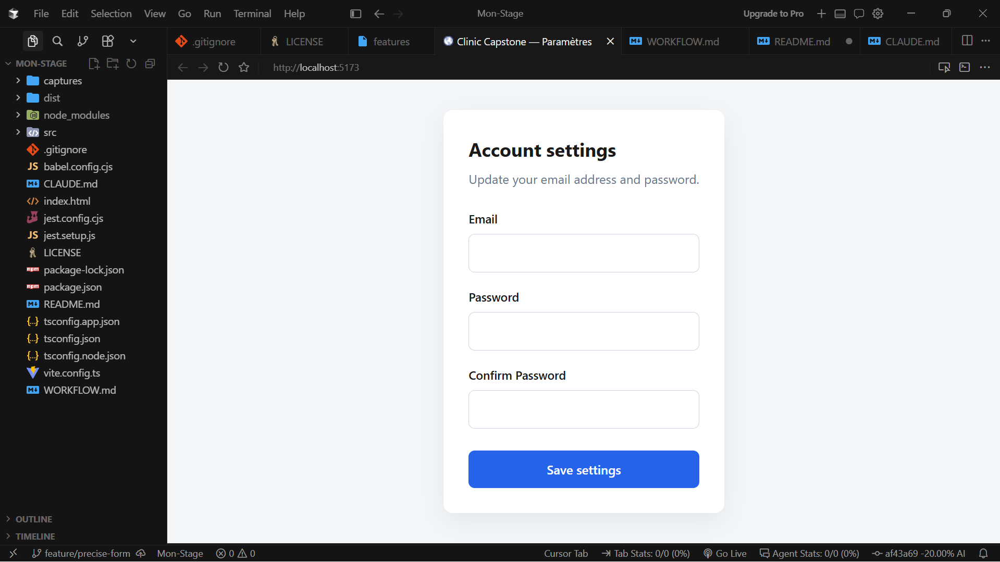
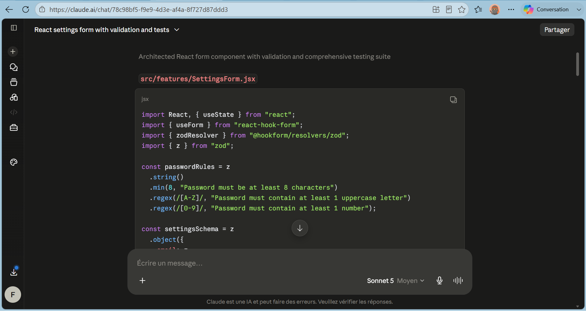
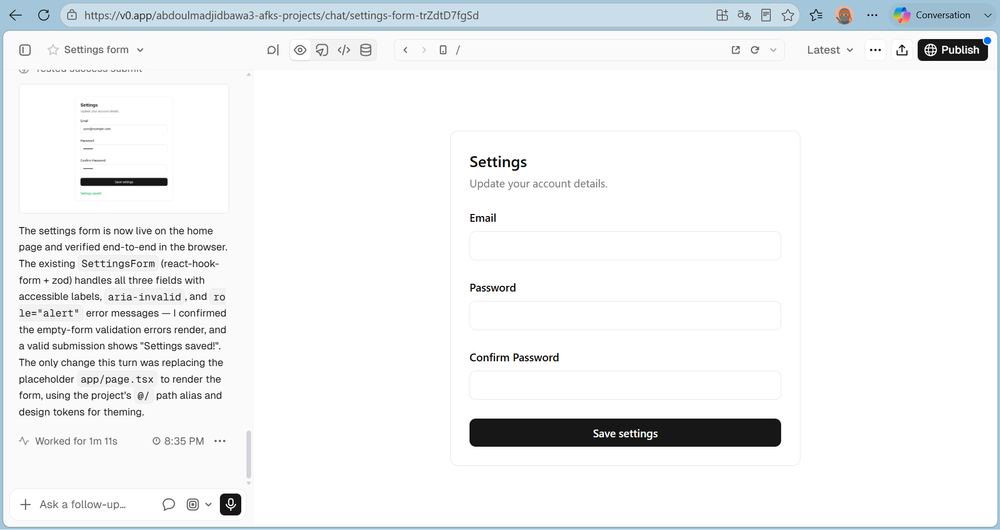

# Clinic Capstone

**Projet FE-01** — Development Environment and AI Toolchain  <br>
**Projet FE-01** — Environnement et chaîne d'outils IA

Setting up the development environment and AI tools for the Clinic Capstone journey.  <br>
Mise en place de l'environnement de développement et des outils IA pour le parcours Clinic Capstone.

## Context / Contexte

This repository corresponds to the first stage of the project: configuring the IDE, Git conventions, and the base workspace before developing features.  <br>
Ce dépôt correspond à la première étape du projet : configuration de l'IDE, des conventions Git et de la base du workspace avant le développement des fonctionnalités.

## Prerequisites / Prérequis

- [Git](https://git-scm.com/)
- [Cursor](https://cursor.com/) (IDE with AI assistance / IDE avec assistance IA)
- Node.js *(if applicable for later steps / si applicable aux prochaines étapes)*

## Installation

```bash
git clone https://github.com/ABRrO-ops/clinic-capstone.git
cd clinic-capstone
```

## Project Structure / Structure du projet

```
Mon-Stage/
├── README.md          # Project documentation / Documentation du projet
├── WORKFLOW.md        # Workflow comparison (FE-03) / Comparaison des workflows (FE-03)
├── CLAUDE.md          # AI IDE conventions / Conventions pour l'IDE IA
├── LICENSE            # Project license / Licence du projet
├── babel.config.cjs   # Babel configuration
├── jest.config.cjs    # Jest configuration
├── jest.setup.js      # Jest setup file / Fichier de configuration Jest
├── vite.config.ts     # Vite configuration
├── package.json
├── tsconfig.json
└── src/
    ├── features/
    │   ├── SettingsForm.jsx
    │   ├── SettingsForm.test.jsx
    │   ├── SettingsForm.css
    │   └── settingsSchema.js
    ├── main.tsx
    ├── App.tsx
    └── index.css

```

## Conventions

- **Commits** : [Conventional Commits 1.0.0](https://www.conventionalcommits.org/fr/)
  - Example / Exemple : `feat: add initial README`
- **IDE** : Cursor (see `CLAUDE.md` / voir `CLAUDE.md`)

## Progress Status / État d'avancement

- [x] Git repository initialization / Initialisation du dépôt Git 
- [x] README and basic conventions / README et conventions de base  
- [x] FE-03: Workflow comparison (vague vs precise) / Comparaison des workflows (vague vs précis)  
- [x] Bonus: Comparison with Claude and v0 / Bonus : Comparaison avec Claude et v0


## Screenshots (FE-03) / Captures d’écran (FE-03)

### Cursor Output / Résultat Cursor


### Claude Output / Résultat Claude


### v0 Output / Résultat v0



## Workflow Comparison / Comparaison des workflows

See [WORKFLOW.md](./WORKFLOW.md) for the detailed comparison between vague and precise prompts, including bonus analysis of Cursor, Claude, and v0.  <br>
Voir [WORKFLOW.md](./WORKFLOW.md) pour la comparaison détaillée entre les invites vagues et précises, incluant l’analyse bonus de Cursor, Claude et v0.
  

## Author / Auteur

Abdoul-Madjid BAWA-2026 

